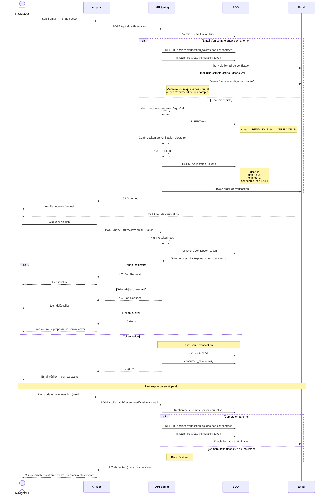

# Séquence : inscription

```mermaid
sequenceDiagram
actor Navigateur
participant Angular
participant API as API Spring
participant BDD
participant Email

    Navigateur->>Angular: Saisit email + mot de passe
    Angular->>API: POST /api/v1/auth/register
    API->>BDD: Vérifie si email déjà utilisé

    alt Email d'un compte encore en attente
        API->>BDD: DELETE anciens verification_tokens non consommés
        API->>BDD: INSERT nouveau verification_token
        API->>Email: Renvoie l'email de vérification
    else Email d'un compte actif ou désactivé
        API->>Email: Envoie "vous avez déjà un compte"
        Note right of API: Même réponse que le cas normal<br/>→ pas d'énumération des comptes
    else Email disponible
        API->>API: Hash mot de passe avec Argon2id
        API->>BDD: INSERT user
        Note right of BDD: status = PENDING_EMAIL_VERIFICATION

        API->>API: Génère token de vérification aléatoire
        API->>API: Hash le token
        API->>BDD: INSERT verification_tokens
        Note right of BDD: user_id<br/>token_hash<br/>expires_at<br/>consumed_at = NULL

        API->>Email: Envoie email de vérification
    end

    API-->>Angular: 202 Accepted
    Angular-->>Navigateur: "Vérifiez votre boîte mail"

    Email-->>Navigateur: Email + lien de vérification
    Navigateur->>Angular: Clique sur le lien
    Angular->>API: POST /api/v1/auth/verify-email + token
    API->>API: Hash le token reçu
    API->>BDD: Recherche verification_token
    BDD-->>API: Token + user_id + expires_at + consumed_at

    alt Token inexistant
        API-->>Angular: 400 Bad Request
        Angular-->>Navigateur: Lien invalide
    else Token déjà consommé
        API-->>Angular: 400 Bad Request
        Angular-->>Navigateur: Lien déjà utilisé
    else Token expiré
        API-->>Angular: 410 Gone
        Angular-->>Navigateur: Lien expiré → proposer un nouvel envoi
    else Token valide
        Note over API,BDD: Une seule transaction
        API->>BDD: status = ACTIVE
        API->>BDD: consumed_at = NOW()
        API-->>Angular: 200 OK
        Angular-->>Navigateur: Email vérifié → compte activé
    end

    Note over Navigateur,Email: Lien expiré ou email perdu
    Navigateur->>Angular: Demande un nouveau lien (email)
    Angular->>API: POST /api/v1/auth/resend-verification + email
    API->>BDD: Recherche le compte (email normalisé)

    alt Compte en attente
        API->>BDD: DELETE anciens verification_tokens non consommés
        API->>BDD: INSERT nouveau verification_token
        API->>Email: Envoie l'email de vérification
    else Compte actif, désactivé ou inexistant
        Note right of API: Rien n'est fait
    end

    API-->>Angular: 202 Accepted (dans tous les cas)
    Angular-->>Navigateur: "Si un compte en attente existe, un email a été envoyé"
```
