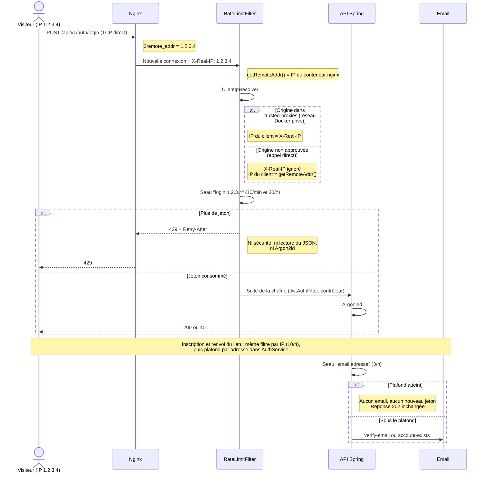

# Séquence : limitation de débit (B4)

```mermaid
sequenceDiagram
actor Visiteur as Visiteur (IP 1.2.3.4)
participant Nginx
participant Filtre as RateLimitFilter
participant API as API Spring
participant Email

    Visiteur->>Nginx: POST /api/v1/auth/login (TCP direct)
    Note right of Nginx: $remote_addr = 1.2.3.4
    Nginx->>Filtre: Nouvelle connexion + X-Real-IP: 1.2.3.4
    Note right of Filtre: getRemoteAddr() = IP du conteneur nginx

    Filtre->>Filtre: ClientIpResolver
    alt Origine dans trusted-proxies (réseau Docker privé)
        Note right of Filtre: IP du client = X-Real-IP
    else Origine non approuvée (appel direct)
        Note right of Filtre: X-Real-IP ignoré<br/>IP du client = getRemoteAddr()
    end

    Filtre->>Filtre: Seau "login:1.2.3.4" (10/min et 30/h)
    alt Plus de jeton
        Filtre-->>Nginx: 429 + Retry-After
        Note right of Filtre: Ni sécurité, ni lecture du JSON,<br/>ni Argon2id
        Nginx-->>Visiteur: 429
    else Jeton consommé
        Filtre->>API: Suite de la chaîne (JwtAuthFilter, contrôleur)
        API->>API: Argon2id
        API-->>Visiteur: 200 ou 401
    end

    Note over Visiteur,Email: Inscription et renvoi du lien : même filtre par IP (10/h),<br/>puis plafond par adresse dans AuthService
    API->>API: Seau "email:adresse" (3/h)
    alt Plafond atteint
        Note right of API: Aucun email, aucun nouveau jeton<br/>Réponse 202 inchangée
    else Sous le plafond
        API->>Email: verify-email ou account-exists
    end
```
