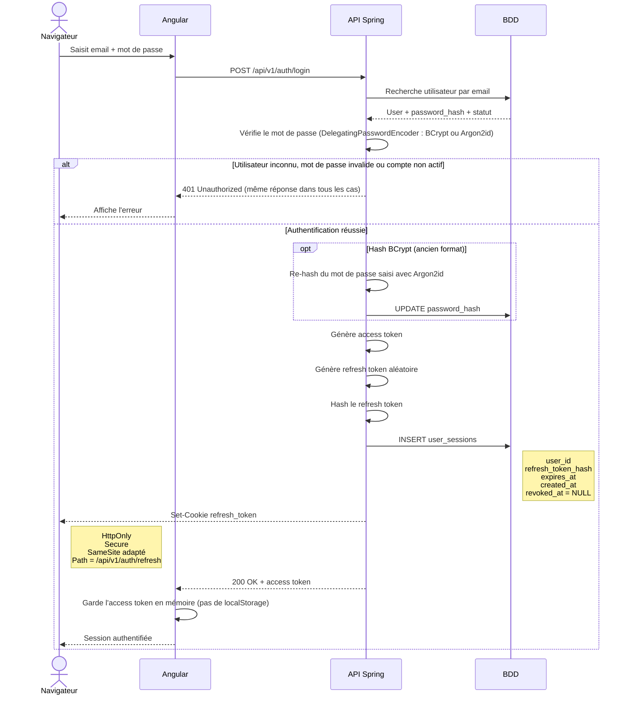

# Séquence : login

```mermaid
sequenceDiagram
actor Navigateur
participant Angular
participant API as API Spring
participant BDD

    Navigateur->>Angular: Saisit email + mot de passe
    Angular->>API: POST /api/v1/auth/login
    API->>BDD: Recherche utilisateur par email
    BDD-->>API: User + password_hash + statut

    API->>API: Vérifie le mot de passe (DelegatingPasswordEncoder : BCrypt ou Argon2id)

    alt Utilisateur inconnu, mot de passe invalide ou compte non actif
        API-->>Angular: 401 Unauthorized (même réponse dans tous les cas)
        Angular-->>Navigateur: Affiche l'erreur
    else Authentification réussie
        opt Hash BCrypt (ancien format)
            API->>API: Re-hash du mot de passe saisi avec Argon2id
            API->>BDD: UPDATE password_hash
        end

        API->>API: Génère access token
        API->>API: Génère refresh token aléatoire
        API->>API: Hash le refresh token
        API->>BDD: INSERT user_sessions
        Note right of BDD: user_id<br/>refresh_token_hash<br/>expires_at<br/>created_at<br/>revoked_at = NULL

        API-->>Navigateur: Set-Cookie refresh_token
        Note right of Navigateur: HttpOnly<br/>Secure<br/>SameSite adapté<br/>Path = /api/v1/auth/refresh

        API-->>Angular: 200 OK + access token
        Angular->>Angular: Garde l'access token en mémoire (pas de localStorage)
        Angular-->>Navigateur: Session authentifiée
    end
```
