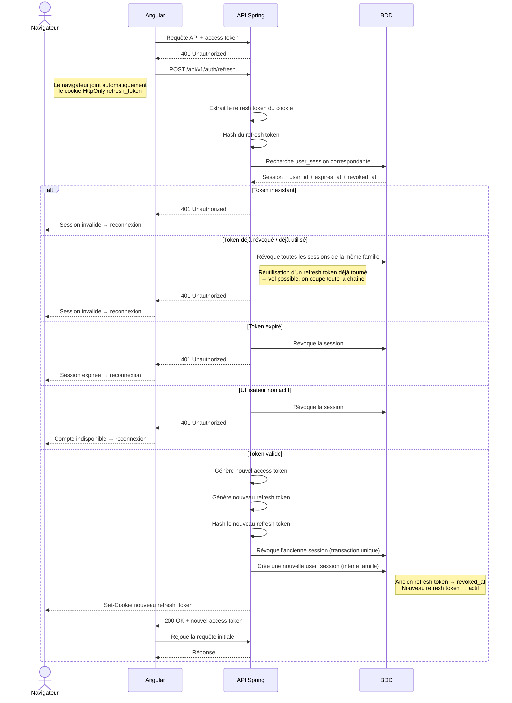

# Séquence : refresh

```mermaid
sequenceDiagram
actor Navigateur
participant Angular
participant API as API Spring
participant BDD

    Angular->>API: Requête API + access token
    API-->>Angular: 401 Unauthorized
    Angular->>API: POST /api/v1/auth/refresh
    Note right of Navigateur: Le navigateur joint automatiquement<br/>le cookie HttpOnly refresh_token

    API->>API: Extrait le refresh token du cookie
    API->>API: Hash du refresh token
    API->>BDD: Recherche user_session correspondante
    BDD-->>API: Session + user_id + expires_at + revoked_at

    alt Token inexistant
        API-->>Angular: 401 Unauthorized
        Angular-->>Navigateur: Session invalide → reconnexion
    else Token déjà révoqué / déjà utilisé
        API->>BDD: Révoque toutes les sessions de la même famille
        Note right of API: Réutilisation d'un refresh token déjà tourné<br/>→ vol possible, on coupe toute la chaîne
        API-->>Angular: 401 Unauthorized
        Angular-->>Navigateur: Session invalide → reconnexion
    else Token expiré
        API->>BDD: Révoque la session
        API-->>Angular: 401 Unauthorized
        Angular-->>Navigateur: Session expirée → reconnexion
    else Utilisateur non actif
        API->>BDD: Révoque la session
        API-->>Angular: 401 Unauthorized
        Angular-->>Navigateur: Compte indisponible → reconnexion
    else Token valide
        API->>API: Génère nouvel access token
        API->>API: Génère nouveau refresh token
        API->>API: Hash le nouveau refresh token

        API->>BDD: Révoque l'ancienne session (transaction unique)
        API->>BDD: Crée une nouvelle user_session (même famille)
        Note right of BDD: Ancien refresh token → revoked_at<br/>Nouveau refresh token → actif

        API-->>Navigateur: Set-Cookie nouveau refresh_token
        API-->>Angular: 200 OK + nouvel access token
        Angular->>API: Rejoue la requête initiale
        API-->>Angular: Réponse
    end
```
